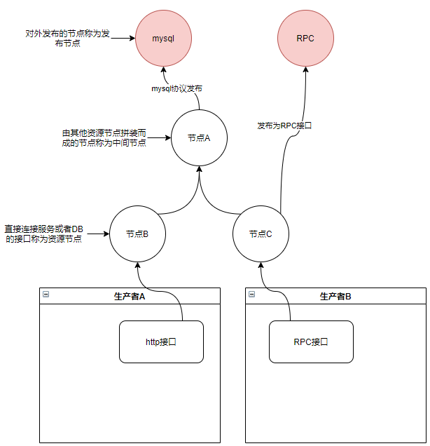

##对接平台

### 概念介绍
对接平台是致力于节省对接时间,便捷接口发布,灵活视图,统一修改查询接口 的一个中间件,也可以嵌入项目中当做框架使用  
[框架链接(my-common/my-common-platform)](my-common/my-common-platform)

### 功能介绍
可以将底层RPC接口,http接口,DB 发布出来成为一个节点,可以通过低代码修改节点的输入与输出  
也可以将两个或多个节点拼装为一个节点,拼装关系由类sql的低代码完成



### 一个http接口加一个rpc接口发布为mysql协议并进行调用流程
```text
详细流程
1.注册生产者
通过生产者注册接口注册,传入生产者信息

2.管理审核通过生产者信息注册
查询待审核用户的信息,通过用户申请接口

3.注册消费者信息
通过消费者注册接口,传入消费者信息

4.管理者审核通过消费者信息
查询待审核用户的信息,通过用户申请接口

5.生产者发布http接口(资源)
发布http接口信息,包含接口url,接口入参demo(json形式),接口出参demo(json形式)

6.生产者发布rpc接口(资源)
发布rpc接口信息,包含接口interface,method,入参demp(json形式),出参demo(json形式)

7.管理审核通过接口发布信息
查询待审核的接口,通过待审核的接口

8.使用生产者账号添加http对应子节点
添加子节点接口(资源类型,资源id,sql,是否是子节点),标识添加哪一种,哪一个接口,接口名称,如果是http则从http接口复制出参,入参, 根据入参与出参校验sql是否正确

9.使用生产者账号添加rpc对应子节点
添加子节点接口(资源类型,资源id,sql,是否是子节点),标识添加哪一种,哪一个接口,接口名称,如果是rpc则从rpc接口复制出参,入参,根据入参与出参校验sql是否正确

10.使用生产者(或者消费者)账号添加整合两个子节点的节点
添加节点,标识整合哪两个节点(不一定是子节点),识别两个待整合节点的接口,接口名称,聚合出参(冗余用),聚合入参(冗余用), 根据聚合的出参与入参,校验sql是否正确,sql对应的联结规则是否正确
实际出入参与名称变化交给sql, sql本身有规定出参入参与出参字段变化的功能

11.使用消费者(或者生产者)将某个节点发布为mysql协议接口
查询节点,选中后发布为mysql协议节点, (这里不需要标识出入参,以sql的形式标识入参,出参),但是数据库里要有出参与入参的冗余,界面或者navicat显示用,注意,界面显示出参与入参全部, navicat只显示出参,入参可以近似看做mysql的隐藏字段. 可以进行查询用,但是默认不显示

12.使用navicat连接
	1.mysql协议登录,校验登录账号,并根据账号权限返回库名称(固定)
	2.use 指定库(固定)
	3.返回表名称(此账号下的所有mysql发布协议)
	4.执行sql语句
		4.1.解析sql语句为多个节点
			例: select a.*,b.* from temp_a a left join temp_b b on a.b_no = b.no where a.id = 1
			解析为查询A节点,B节点,并且因为left join 则 先执行A 再执行B (此处存疑, 可以根据条件判断.由于A表条件多,所以A表先查,依据A表结果根据关联关系去查询B表)
		4.2. 执行每个节点,以上述发布的mysql节点(以下称mroot)为例
			mroot本身的sql为 select ah.id as aid,br.id bid,ah.name from A_http ah left join B_RPC br on ah.patient_id = br.patient_id and ah.sample_no = br.sample_no where ah.patient_id = #{patient_id}
			
			上述入参可以解析为aid,bid,ah_name,patient_id 出参解析为 aid,bid,ah_name,patient_id 其中入参是where以及查出来的参数(先判断是否关联下层入参,如果没有,则查询出来最后再进行内存筛选),出参是select后的列表
			
			1.输入sql为 select * from mroot where ah_name = "35" and patient_id = 3456
			2.则输入sql解析为执行计划-> 执行mroot节点,返回所有出参, 入参为 ah_name和patient_id
			3.执行执行计划-> 匹配A节点本身的入参,可以匹配到patient_id为http节点的入参,可以下钻 最终获取需要执行的sql为
			select ah.id as aid,br.id bid,ah.name from A_http ah left join B_RPC br on ah.patient_id = br.patient_id and ah.sample_no = br.sample_no where ah.patient_id = 3456
			(执行结束后通过ah_name内存筛选结果并返回)(执行节点返回后依据json来返回,如果是复杂json,则 碾平,但是尽量不要使用碾平,这里需要打印日志提示)
			4. 拆解sql为执行计划-> 执行A_http节点 入参为patient_id      执行B_RPC节点 入参为A_http节点返回的sample_no以及入参的patient_id 根据 连接条件连接数据
			解析为执行计划之后就是递归执行, 直到子节点解析完成执行计划之后
			
			子节点如果是mysql 则要知道入参是什么, 出参是什么, 查询的是哪个表  然后组装sql语句
			子节点如果是RPC或者HTTP 则要知道入参是什么,然后查询出来之后筛选出参
			子节点如果是MQ (未知... TODO )
		5.最终节点依据json形式, 解析为二维表格返回给mysql
```
